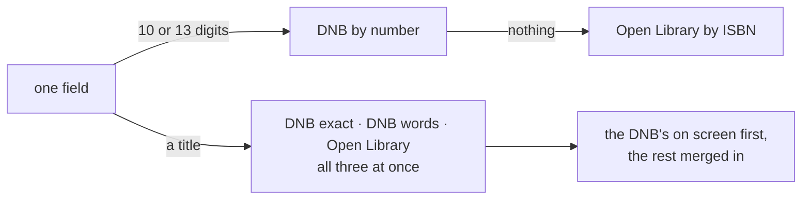
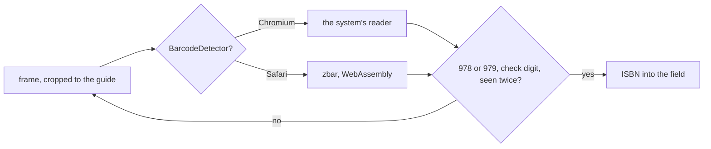

# Lesestapel

A small web app for recording books read and seeing the reading statistics that
follow from them. It replaces bookstats.de, is mobile first, and serves ten
accounts which, thanks to row level security, never see each other's shelves.
The interface is German; everything else in this repository is English.

## Stack

- **Frontend:** React 19, TypeScript, Vite, Tailwind CSS 4, React Router
- **Backend:** Supabase — auth, Postgres with row level security, storage for covers
- **Data:** a `books` table, loaded once and filtered in the browser, a
  `profiles` table of one row per reader, and a `recommendations` table, the only
  place where an account reads rows it does not own

Every book is loaded at startup, about 500 KB, which makes search, filtering and
all statistics instant without a further request. Covers stay out of that payload
on purpose; they are files in a bucket, so the browser can cache them. The feed
is not in it either and is fetched when its tab is first opened: it is the one
thing on screen that depends on what other people did, and the splash should not
wait on that.

Supabase is asked for in parts — `auth-js`, `postgrest-js` and `storage-js`
rather than `supabase-js`, which builds a realtime client in its constructor that
this app never subscribes to. The parts do not wire themselves together, so
`src/lib/supabase.ts` does it, and the key the session is stored under is derived
exactly the way `supabase-js` derives it: `sb-<ref>-auth-token`. That string is
worth copying rather than inventing, because getting it wrong signs everybody out
at once.

## Setup

```bash
pnpm install
cp .env.example .env   # project URL and publishable key
pnpm dev
```

Six things are prepared in Supabase itself:

1. Run `supabase/schema.sql` once in the SQL editor. It creates the enums, the
   `books` table, its indexes, four RLS policies and the `updated_at` trigger.
2. Run `supabase/profiles.sql`. It adds `profiles`, its two policies and a
   trigger on `auth.users` that gives every account a row.
3. Run `supabase/recommendations.sql`, after the other two, because it points at
   both. Besides the new table it replaces the select policy on `profiles`,
   which is the only thing any of these files change about an existing table.
4. Create each account by hand under Authentication. The app has no sign-up on
   purpose, so a new reader is one row in `auth.users` and the row the trigger
   makes for it.
5. Create a public storage bucket named `cover` and grant the accounts access to
   it, see `supabase/storage.sql`.
6. Under Authentication → URL Configuration, set the site URL to the deployed
   address and add `http://localhost:5180/**` to the redirect list. A password
   reset only returns to addresses on that list, and falls back to the site URL
   without an error when it matches none.

The dev server is pinned to 5180 in `vite.config.ts`, and `strictPort` keeps it
there: the port is named in that redirect list, so a server that quietly moved
to the next free one would break the way back in and say nothing.

## Scripts

| Command           | Purpose                         |
| ----------------- | ------------------------------- |
| `pnpm dev`        | Development server              |
| `pnpm build`      | Type check and production build |
| `pnpm preview`    | Serve the production build      |
| `pnpm lint`       | Run oxlint over the project     |
| `pnpm test`       | Run the test suite once         |
| `pnpm test:watch` | Re-run tests as files change    |

## Covers

Tiles are 5:8, not the obvious 2:3 — over the first 412 covers a 2:3 box cropped
87 percent of them top and bottom, where the title and the author sit.

| Path                           | Belongs to              | Deleted       |
| ------------------------------ | ----------------------- | ------------- |
| `isbn/<isbn>.jpg`              | the edition             | never         |
| `<user_id>/<stem>-<epoch>.jpg` | the reader who chose it | with its book |

Deleting a shared file would be a question about other people's rows, which is
what row level security stops a browser from asking — a file that is never
deleted never raises it. The first upload for an edition is the one everybody
gets; whoever wants another chooses their own.

The rule is the path, not a hidden `owner_id`. A name under `isbn/` has to look
like an ISBN, checked in the client and again in the policy, because the form's
ISBN field is free text and `unbekannt` strips down to nothing. A ten digit ISBN
is converted to its thirteen digit form first, so an edition has one address and
not two — a scanner only ever yields EAN-13.

The select policy reaches no further than the reader's own folder. Reading is not
needed to show a cover, because the bucket is public and `getPublicUrl` sends no
request, and listing `isbn/` would hand out ISBNs. But deleting needs it: storage
looks an object up before it removes it, that lookup runs under row level
security, and without select it finds nothing, removes nothing and reports an
empty list rather than an error.

A dashboard changes policies without leaving a diff, so the file is worth nothing
unchecked:

```sql
select policyname, cmd, qual, with_check from pg_policies
where schemaname = 'storage' and tablename = 'objects' order by cmd, policyname;
```

## Data model

Stored values are English, the German labels are mapped in `src/types.ts`.
Authors are a `text[]` of display names rather than separate first and last
names, which breaks on `Emily St. John Mandel` and on `Jang Ryujin`, where the
family name comes first.

A book counts towards a year when it is read and carries a finish date. Anything
being read, abandoned or merely wanted is in no yearly figure at all, which is
why a finished book without a date stays invisible until somebody gives it one.

## Profiles

`profiles` carries a display name and an avatar and nothing else. Rows are made
by the trigger on `auth.users` and there is no insert policy, so a browser cannot
invent one. The six pictures are drawn in `src/components/Avatar.tsx`: a coloured
disc, a motif in cream, and in every one the same golden book — which is why no
disc can go yellow.

Every signed-in account can read every row of it, which is what a feed needs to
name who recommended a book. The table was written to hold nothing else so that
this would cost nothing when the day came. It did cost one thing, worth knowing
about anywhere else the same shape appears: `ProfileContext` used to ask for its
row with no filter and let row level security return the only one it was allowed
to see. Ten rows came back the moment the policy opened. RLS is a gate, not a
where clause, and a query that wants one row has to say so.

There is no unique handle. A unique key only earns its place when a string has
to resolve to one person with nobody there to be asked: a pasted link, a name in
somebody else's text. Choosing from a list is not that case, and neither is a
mention that is picked rather than typed — what gets stored is the id, what gets
shown is the current name, so a rename leaves old text correct.

The profile also holds the backup: JSON as a complete, re-importable copy
including `source_meta`, CSV with German headers for a spreadsheet, both
generated in the browser. The covers are not part of it, but they can be fetched
again from their ISBN.

## Recommendations

A recommendation is something somebody does, not something derived from a shelf.
Nothing about a book leaves its account until a reader recommends it, on that
book's own page, which is why there is no per-book switch for what may be shared:
the act is the switch.

The row copies the title, the authors and the ISBN rather than pointing at a
`books` row. That is what keeps the rest of the app intact — no account ever
reads a book that is not its own, and every policy on `books` is still
`auth.uid() = user_id`. It also makes a recommendation a statement from a day
rather than a live view: rename the book or delete it, and what was said about it
stands.

```sql
with check (
  auth.uid() = user_id
  and exists (
    select 1 from public.books b
    where b.id = book_id and b.user_id = auth.uid()
      and b.status in ('read', 'reading')
  )
)
```

That one `exists` does three things. It proves the book belongs to whoever is
recommending it, because the subquery runs with their rights and can only find
their own rows. It keeps the someday pile and the abandoned ones out. And a null
`book_id` fails it, which is the rule that recommending starts at a book. There
is no update policy on purpose — a recommendation is taken back, not rewritten.

The sentence is not optional, in the dialog and in the column. A title with a
name under it is what a shelf already shows; what makes it a recommendation is
somebody saying why, however short. The check keeps that honest — `btrim` means
a line of spaces is not a sentence.

The cards show covers without storing a path to one. They derive
`isbn/<isbn>.jpg`, the shared address from the Covers section: public, never
deleted, and written by whoever first added that edition. A recommendation can
therefore never point into a stranger's folder, and a book whose cover nobody has
uploaded yet quietly gets one on the day somebody does.

A card carries a single button and it always speaks about the book — the copy on
your shelf if you have it, your stack if you do not. Taking a recommendation back
is not one of them; that lives on the book's own page, next to the button that
made it, rather than in two places. `findOnShelf` decides which of the two a card
offers, by ISBN or else by title and author, and normalises to NFC on the way,
because the imported titles spell their umlauts in two code points.

## Passwords

Changing a password signs in again with the old one first. Supabase does not ask
for it, the session alone is enough, and a phone lying around unlocked should not
be the whole account.

A forgotten one is a link by mail, and the way back is the half that surprises.
The link carries a token that `detectSessionInUrl` turns into a session, so the
reader is signed in before choosing anything — without `PASSWORD_RECOVERY` being
watched for, they would land in the shelf with the same problem. The page that
asks for the address answers "if there is an account for this address", never
"there is", because the other sentence is a way to find out who has one.

Refusals are repeated rather than swallowed: `src/lib/password.ts` translates
`same_password` and `weak_password` and shows anything else in Supabase's own
words. A new password is typed once, with an eye to uncover it, because repeating
only catches mistakes nobody makes twice and a password manager fills both fields
alike.

The mail goes through Supabase's own SMTP, which is throttled to a handful an
hour and whose template cannot be edited. Both lift with a custom SMTP server,
and neither is worth one until somebody is actually kept waiting.

## Adding a book

Adding starts with a search rather than an empty form. One field takes both an
ISBN and a title, and what happens behind it differs:



The DNB goes first because it carries the German editions. The form opens with
the dates empty, because entering one costs less than noticing a wrong one.

Three filters come from reconciling the imported library against these
catalogues: MARC field 700 holds translators as often as further authors, so
entries with a `$t` or a non-`aut` relator are dropped; series names are checked
against publisher imprints, or books land in a series called `Goldmann`; study
guides and audio editions lose title matches.

Covers are the one thing not fetched by the browser, and the reason
`api/cover.ts` is deployed alongside the app: Open Library allows its images to
be read across origins, the better scans behind the DNB portal do not, so a
browser left to itself could only ever keep the weaker source.

## Scanning the barcode

The same field takes a scan. Every barcode on a book is a Bookland EAN-13, which
is the ISBN-13 itself, so nothing behind the field had to change.



Both gates in that diagram answer something. Books carry a second, smaller
barcode for the price, so without the 978-or-979 rule a scan succeeds cheerfully
with `52799`. And a number has to arrive twice because a single misread that
satisfies the check digit is rare but possible, and one wrong book quietly
prefilled is worse than a second of waiting.

A camera needs a secure context, so trying a scan from a phone means a deployed
preview rather than a LAN address.

## Planned

- Ratings. The column is decided: `smallint` between 1 and 5, so half stars
  would be a migration rather than a design choice.
- A price, and who recommended a book. A column each, a field each.
- A progress indicator, which needs somewhere to keep the page somebody is on.
- A panel for audiobooks: hours rather than pages. They carry no length at all —
  `page_count` counts pages, and the import refused figures counting CDs.
- A calendar of when each book was started and finished.
- Mentions in a recommendation — picked from a list, stored as an id, shown as
  the current name. Notes are plain text and none of them holds a marker yet, so
  this is client work; only asking where somebody is mentioned would want a
  column.
- Reactions under a recommendation. Its own table, unique on the pair of
  recommendation and reader, nothing to change about what is there now.
- Shareable lists and shareable statistics, with a switch on the profile for what
  is shared at all.

The last one is the only one that is not a column and a field, or a table beside
the ones already there. Every policy on `books` says `auth.uid() = user_id`, and
the whole app is written on the assumption that a browser can see nothing but its
own rows. The shared covers were the one thing several accounts already held in
common, and they got away with it by holding nothing private: a picture of an
edition says only that the edition exists. `recommendations` is the second such
thing and takes the same way out — it shares what a reader chose to say, not what
a reader owns.

A shelf somebody can open, on the other hand, would be the first time a `books`
row is read by an account that does not own it, and that is a change to the
security model before it is a screen. The switch belongs to that day, not to the
feed: what the feed shares is decided one recommendation at a time.
