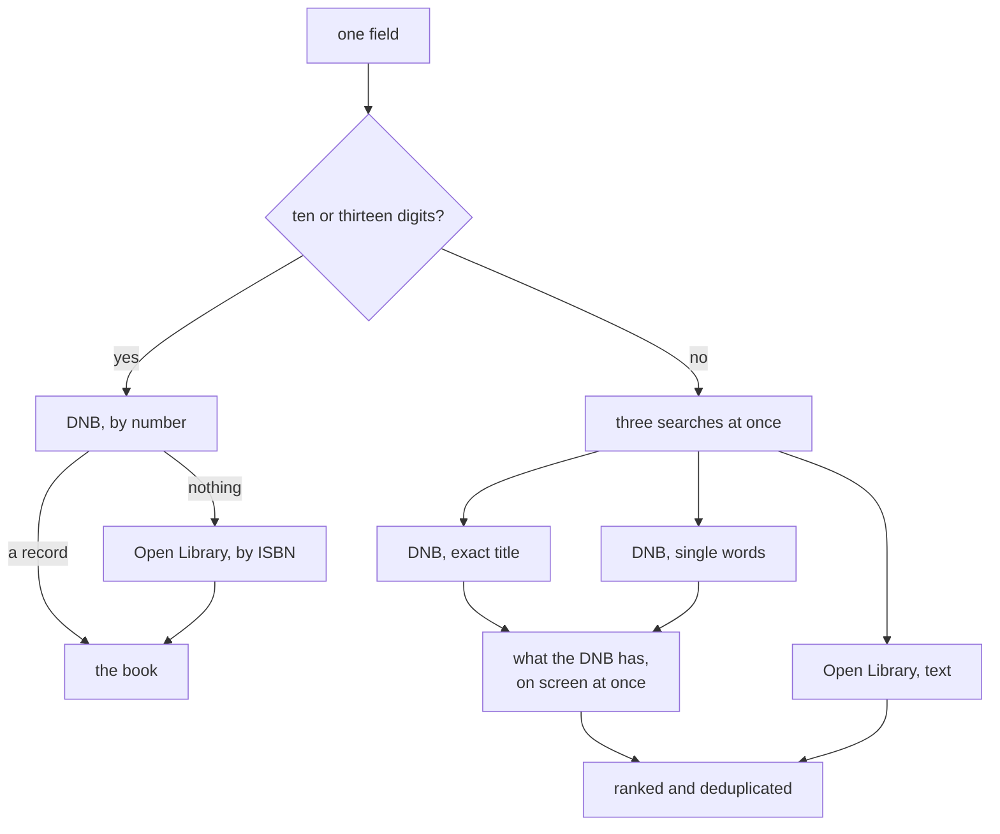
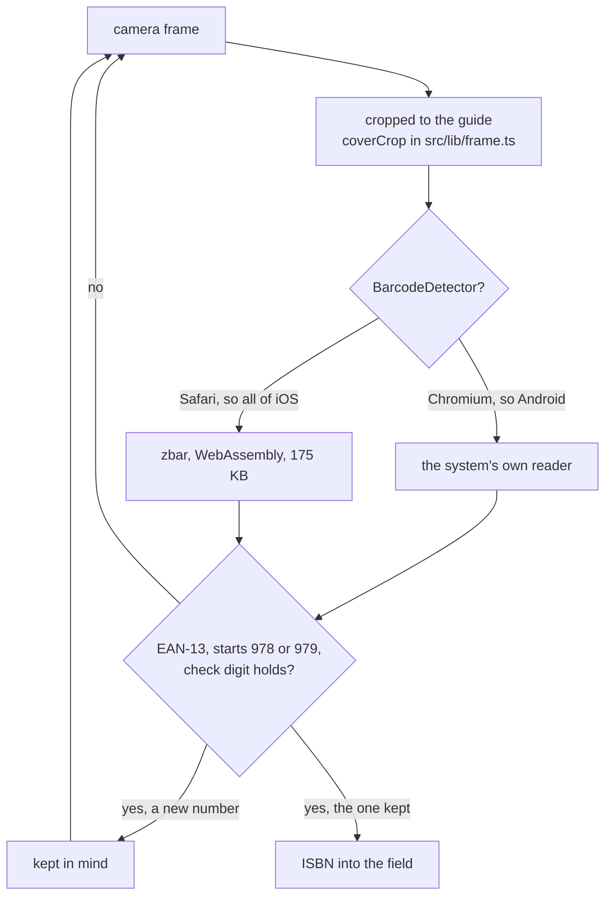

# Lesestapel

A small web app for recording books read and seeing the reading statistics that
follow from them. It replaces bookstats.de, is mobile first, and serves ten
accounts which, thanks to row level security, never see each other's shelves.
The interface is German; everything else in this repository is English.

## Stack

- **Frontend:** React 19, TypeScript, Vite, Tailwind CSS 4, React Router
- **Backend:** Supabase — auth, Postgres with row level security, storage for covers
- **Data:** one `books` table, loaded once and filtered in the browser

Loading every book at startup costs about 500 KB and makes search, filtering and
all statistics instant without a single further request. Covers deliberately stay
out of that payload; they are files in a bucket, so the browser can cache them.

Supabase is asked for in parts — `auth-js`, `postgrest-js` and `storage-js`
rather than `supabase-js`, which builds a realtime client in its constructor that
this app never subscribes to. The parts do not wire themselves together, so
`src/lib/supabase.ts` does it: every request reads the access token out of the
current session, and the key that session is stored under is derived exactly the
way `supabase-js` derives it, `sb-<ref>-auth-token`. That string is worth copying
rather than inventing, because getting it wrong signs everybody out at once.

The shelf is the only page in the first chunk. The statistics page, the book form
and the catalogue search are fetched when they are opened, as the scanner already
was. The two typefaces are served from `public/fonts` instead of Google's CDN,
which keeps a render-blocking request to a third-party host off the start.

## Setup

```bash
npm install
cp .env.example .env   # project URL and publishable key
npm run dev
```

Three things are prepared in Supabase itself:

1. Run `supabase/schema.sql` once in the SQL editor. It creates the enums, the
   `books` table, its indexes, four RLS policies and the `updated_at` trigger.
2. Create each account by hand under Authentication. The app has no sign-up on
   purpose, so a new reader is one row in `auth.users` and nothing else.
3. Create a public storage bucket named `cover` and grant the accounts access to
   it, see `supabase/storage.sql`.

## Scripts

| Command           | Purpose                        |
| ----------------- | ------------------------------ |
| `npm run dev`     | Development server             |
| `npm run build`   | Type check and production build |
| `npm run preview` | Serve the production build     |
| `npm run lint`    | Run oxlint over the project    |

## Covers

The book row points at a file through `cover_path`; books without one fall back
to a pattern generated from the title, which also catches an image that fails to
load. Tiles are 5:8, not the obvious 2:3 — over the first 412 covers a 2:3 box
cropped 87 percent of them top and bottom, where the title and the author sit.

| Path                           | Belongs to              | Deleted       |
| ------------------------------ | ----------------------- | ------------- |
| `isbn/<isbn>.jpg`              | the edition             | never         |
| `<user_id>/<stem>-<epoch>.jpg` | the reader who chose it | with its book |

Deleting a shared file would be a question about other people's rows, which is
what row level security stops a browser from asking — a file that is never
deleted never raises it. The first upload for an edition is the one everybody
gets; whoever wants another chooses their own, which lands in their folder and
wins for their book.

The rule is the path, not a hidden `owner_id`: an account writes into its own
folder or into `isbn/` and deletes only inside its own. A name under `isbn/` has
to look like an ISBN, checked in the client and again in the policy, because the
form's ISBN field is free text and `unbekannt` strips down to nothing. Uploading
onto a shared name that exists answers 409 and is the normal case, not an error.
There is no select policy: the bucket is public and `getPublicUrl` needs no
request, while allowing reads would allow listing — and the file names are ISBNs.

A dashboard changes policies without leaving a diff, so the file is worth nothing
unchecked:

```sql
select policyname, cmd, qual, with_check from pg_policies
where schemaname = 'storage' and tablename = 'objects' order by cmd, policyname;
```

## Data model

Stored values are English — `reading`, `paperback`, `borrowed` — and the German
labels shown on screen are mapped in `src/types.ts`. Authors are a `text[]` of
display names rather than separate first and last names, which breaks on
`Emily St. John Mandel` and on `Jang Ryujin`, where the family name comes first.

Statistics count a book when it is read and carries a finish date, and they count
it in the year of that date. Books being read, abandoned or merely wanted are not
part of any yearly figure.

## Backup

The statistics page exports the whole library: JSON as a complete, re-importable
backup including `source_meta`, CSV with German headers for a spreadsheet. Both
are generated in the browser. The covers are not part of it, but they can be
fetched again from their ISBN.

## Adding a book

Adding starts with a search rather than an empty form. One field takes both an
ISBN and a title, and what happens behind it differs:



Both catalogues answer the browser directly, with no server in between. By number
the DNB goes first because it carries the German editions, and Open Library is
asked only if that comes back empty. By title all three run together and the
DNB's answers go on screen the moment they arrive, rather than making somebody
wait for the slower search to finish.

The form then opens prefilled, with the status set to read and the dates empty —
entering a date costs less than noticing a wrong one, and a read book without a
finish date stays out of every yearly figure until somebody says it.

Three filters come from reconciling the imported library against these same
catalogues: MARC field 700 holds translators as often as further authors, so
entries with a `$t` or a non-`aut` relator are dropped; series names are checked
against publisher imprints, or books land in a series called `Goldmann`; study
guides and audio editions lose title matches.

Covers are the one exception to answering the browser directly, and the reason
`api/cover.ts` is deployed alongside the app: Open Library allows its images to
be read across origins, the better scans behind the DNB portal do not, so a
browser left to itself could only ever keep the weaker source. The size and
proportion gate sits there too, written once, so the browser only ever sees a
picture worth keeping.

## Scanning the barcode

The same field takes a scan. Every barcode on a book is a Bookland EAN-13, which
is the ISBN-13 itself, so nothing behind the field had to change.



Each gate answers something. Books carry a second, smaller barcode for the price,
so without the 978-or-979 rule and the check digit a scan succeeds cheerfully
with `52799`. A number has to arrive twice, though not in consecutive frames — a
frame that decodes nothing changes nothing, while a different number starts the
count over — because a single misread that satisfies the check digit is rare but
possible, and one wrong book quietly prefilled is worse than a second of waiting.

zbar is loaded on the first scan and not before, so on a phone that carries a
system reader it is never fetched at all. A camera needs a secure context, so
trying a scan from a phone means a deployed preview rather than a LAN address.

## Planned

- Ratings. The column is already there and already decided: `smallint` between 1
  and 5, so half stars would be a migration rather than a design choice.
- A price, and who recommended a book. A column each, a field each.
- A progress indicator for books being read, which needs somewhere to keep the
  page somebody is on.
- A panel of its own for audiobooks: hours rather than pages, time listened, the
  longest one. Audiobooks currently carry no length at all — `page_count` counts
  pages, and the import deliberately refused a figure that counted CDs or minutes.
- A calendar of when each book was started and finished.
- A feed of recommendations, shareable lists, shareable statistics, and a profile
  page with a switch for what is shared at all.

The sharing ideas are the only ones that are not a column and a field. Every
policy on `books` says `auth.uid() = user_id`, and the whole app is written on
the assumption that a browser can see nothing but its own rows. The shared covers
are the one thing several accounts already hold in common, and they get away with
it by holding nothing private: a picture of an edition says only that the edition
exists. Anything shared beyond that needs a second way in that grants a reader
something without handing over the shelf, which is a change to the security model
before it is a screen.
